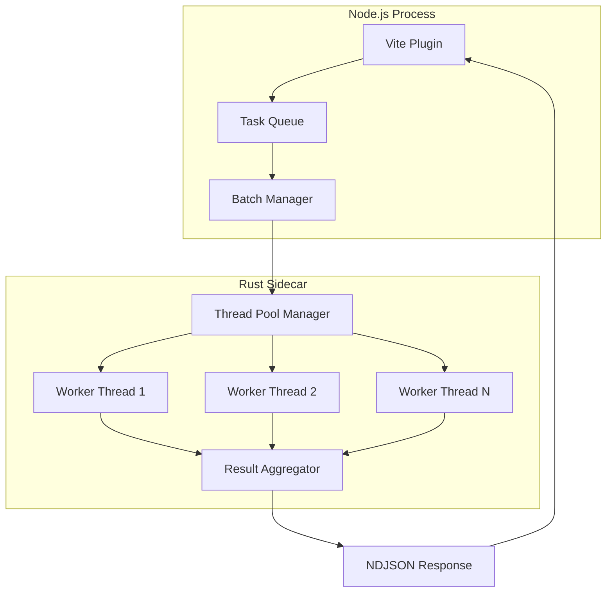

# Specification: Parallel Processing for Fast MD-X

## Overview
Implement multi-threaded parallel processing in the Rust sidecar to dramatically improve Markdown/MDX transformation performance by utilizing all available CPU cores.

## Goals
- **Primary**: Achieve 3-5x performance improvement on multi-core systems
- **Secondary**: Maintain memory efficiency under 100MB for 1000 pages
- **Tertiary**: Ensure thread safety and data consistency

## Non-Goals
- Distributed processing across multiple machines
- GPU acceleration
- Real-time streaming updates

## Background
Current implementation processes files sequentially in a single thread, leaving CPU cores underutilized. Modern systems have 4-32 cores that could process multiple Markdown files simultaneously.

## Detailed Design

### Architecture



### Thread Pool Implementation

```rust
pub struct ThreadPool {
    workers: Vec<Worker>,
    sender: mpsc::Sender<Task>,
    receiver: Arc<Mutex<mpsc::Receiver<Result>>>,
}

impl ThreadPool {
    pub fn new(size: usize) -> Self {
        // Create pool with size = CPU cores
        let size = size.min(num_cpus::get());
        // Initialize workers
    }
    
    pub async fn process_batch(&self, files: Vec<TransformRequest>) -> Vec<TransformResponse> {
        // Distribute work across threads
        // Collect results maintaining order
    }
}
```

### Batching Strategy

1. **Adaptive Batching**: Group files by size for balanced distribution
2. **Priority Queue**: Process larger files first to minimize tail latency
3. **Backpressure**: Limit queue size to prevent memory overflow

### Communication Protocol

#### Batch Request
```json
{
  "jsonrpc": "2.0",
  "id": "batch-001",
  "method": "transformBatch",
  "params": {
    "files": [
      { "file": "doc1.md", "content": "..." },
      { "file": "doc2.md", "content": "..." }
    ],
    "options": {
      "parallel": true,
      "maxWorkers": 8
    }
  }
}
```

#### Progress Updates
```json
{
  "jsonrpc": "2.0",
  "method": "progress",
  "params": {
    "batchId": "batch-001",
    "completed": 15,
    "total": 100,
    "currentFile": "doc15.md"
  }
}
```

## Performance Requirements

### Throughput
- **Target**: >1000 pages/second on 8-core machine
- **Minimum**: >500 pages/second on 4-core machine

### Latency
- **P50**: <1ms per page
- **P95**: <5ms per page
- **P99**: <10ms per page

### Resource Usage
- **Memory**: <100MB for 1000 concurrent pages
- **CPU**: >80% utilization on all cores
- **Threads**: 2x CPU cores (compute + I/O)

## Testing Strategy

### Unit Tests
```rust
#[test]
fn test_thread_pool_creation() {
    let pool = ThreadPool::new(4);
    assert_eq!(pool.worker_count(), 4);
}

#[test]
fn test_parallel_processing() {
    let files = generate_test_files(100);
    let results = pool.process_batch(files).await;
    assert_eq!(results.len(), 100);
}
```

### Stress Tests
- 10,000 files concurrent processing
- Memory pressure scenarios
- Thread pool exhaustion handling
- Crash recovery

### Performance Benchmarks
```typescript
describe('Parallel Processing Performance', () => {
  test('processes 1000 files under 1 second', async () => {
    const start = performance.now();
    const results = await processWithParallel(generateFiles(1000));
    const duration = performance.now() - start;
    expect(duration).toBeLessThan(1000);
  });
  
  test('achieves >0.9 parallel efficiency', async () => {
    const single = await benchmarkSingleCore();
    const parallel = await benchmarkMultiCore(8);
    const efficiency = (single.duration / parallel.duration) / 8;
    expect(efficiency).toBeGreaterThan(0.9);
  });
});
```

## Implementation Phases

### Phase 1: Thread Pool (Week 1)
- [ ] Implement basic thread pool in Rust
- [ ] Add work distribution logic
- [ ] Create result aggregation

### Phase 2: Batch Processing (Week 2)
- [ ] Implement batch RPC method
- [ ] Add progress reporting
- [ ] Handle partial failures

### Phase 3: Optimization (Week 3)
- [ ] Implement adaptive batching
- [ ] Add priority queue
- [ ] Optimize memory usage

### Phase 4: Testing & Tuning (Week 4)
- [ ] Complete test suite
- [ ] Performance benchmarking
- [ ] Production hardening

## Success Metrics

1. **Performance**: 3-5x speedup on 8-core machines
2. **Reliability**: <0.01% failure rate
3. **Efficiency**: >90% CPU utilization
4. **Memory**: <100MB peak usage

## Security Considerations

- Thread-safe data structures
- No shared mutable state
- Proper error boundaries
- Resource limits enforcement

## Rollout Plan

1. **Alpha**: Feature flag `FASTMD_PARALLEL=true`
2. **Beta**: Opt-in for selected users
3. **GA**: Default enabled with fallback

## Dependencies

- `tokio`: Async runtime
- `rayon`: Data parallelism
- `crossbeam`: Lock-free data structures
- `num_cpus`: CPU detection

## Alternatives Considered

1. **Process Pool**: Higher overhead, better isolation
2. **Async Only**: Limited CPU parallelism
3. **Work Stealing**: More complex, marginal gains

## FAQ

**Q: What happens if a thread crashes?**
A: The thread pool will restart the worker and retry the task once.

**Q: How many threads should be used?**
A: Default to CPU cores, configurable via `FASTMD_WORKERS`.

**Q: Will this work on single-core machines?**
A: Yes, it will gracefully degrade to sequential processing.

## References

- [Rust Fearless Concurrency](https://doc.rust-lang.org/book/ch16-00-concurrency.html)
- [Tokio Tutorial](https://tokio.rs/tokio/tutorial)
- [Rayon Parallelism](https://github.com/rayon-rs/rayon)