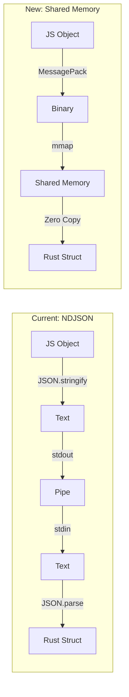

# Specification: High-Performance IPC for Fast MD-X

## Overview
Replace NDJSON text-based IPC with high-performance binary protocols and shared memory to eliminate serialization overhead and reduce latency.

## Goals
- **Primary**: Reduce IPC latency by 50-70%
- **Secondary**: Eliminate serialization/deserialization overhead
- **Tertiary**: Support zero-copy data transfer for large files

## Non-Goals
- Network transparency (local only)
- Windows named pipes optimization (Unix focus)
- Backward compatibility with NDJSON

## Background
Current NDJSON implementation has significant overhead:
- JSON serialization/deserialization: ~30% of processing time
- Text encoding/decoding: ~10% overhead
- Multiple data copies: Node → stdout → stdin → Rust

## Detailed Design

### IPC Architecture Comparison



### Communication Strategies

#### 1. Unix Domain Socket + MessagePack
```rust
// Fast binary protocol over UDS
pub struct UdsTransport {
    socket: UnixStream,
    encoder: MessagePackEncoder,
    decoder: MessagePackDecoder,
}

impl UdsTransport {
    pub async fn send<T: Serialize>(&mut self, msg: &T) -> Result<()> {
        let bytes = self.encoder.encode(msg)?;
        self.socket.write_all(&bytes).await?;
        Ok(())
    }
}
```

#### 2. Shared Memory with Ring Buffer
```rust
// Zero-copy shared memory communication
pub struct SharedMemoryTransport {
    shm: MmapMut,
    ring: RingBuffer,
    semaphore: Semaphore,
}

impl SharedMemoryTransport {
    pub fn write_file(&mut self, content: &[u8]) -> Result<FileHandle> {
        // Direct memory mapping, no copy
        let offset = self.ring.allocate(content.len())?;
        unsafe {
            ptr::copy_nonoverlapping(
                content.as_ptr(),
                self.shm.as_mut_ptr().add(offset),
                content.len()
            );
        }
        Ok(FileHandle { offset, len: content.len() })
    }
}
```

### Protocol Design

#### Message Format (MessagePack)
```typescript
interface FastMessage {
  version: 1;
  type: 'request' | 'response' | 'notification';
  id?: number;
  method?: string;
  params?: Uint8Array;  // Pre-encoded payload
  result?: Uint8Array;
  error?: ErrorInfo;
}
```

#### Shared Memory Layout
```
┌─────────────────────────────────────┐
│ Header (64 bytes)                   │
├─────────────────────────────────────┤
│ Ring Buffer Metadata (256 bytes)    │
├─────────────────────────────────────┤
│ Data Region (configurable, 10MB)    │
│ ┌─────────────────────────────────┐ │
│ │ File 1 Content                  │ │
│ ├─────────────────────────────────┤ │
│ │ File 2 Content                  │ │
│ ├─────────────────────────────────┤ │
│ │ ...                             │ │
│ └─────────────────────────────────┘ │
└─────────────────────────────────────┘
```

### Node.js Implementation

```typescript
// Native binding for shared memory
import { SharedMemory } from '@fastmd/native-ipc';

class FastIPC {
  private shm: SharedMemory;
  private socket: Socket;
  
  async connect(path: string) {
    // Create shared memory region
    this.shm = await SharedMemory.create({
      size: 10 * 1024 * 1024, // 10MB
      path: `/tmp/fastmd-${process.pid}.shm`
    });
    
    // Connect to Unix socket for control messages
    this.socket = net.connect(path);
  }
  
  async transformFile(content: string): Promise<string> {
    // Write directly to shared memory
    const handle = await this.shm.write(content);
    
    // Send only reference via socket
    await this.sendControl({
      method: 'transform',
      handle: handle
    });
    
    // Read result from shared memory
    return await this.shm.read(response.handle);
  }
}
```

## Performance Requirements

### Latency
- **Control Messages**: <0.1ms
- **1KB File Transfer**: <0.2ms  
- **1MB File Transfer**: <1ms
- **10MB File Transfer**: <5ms

### Throughput
- **Small Messages**: >100,000 msg/sec
- **Large Files**: >1GB/sec transfer rate

### Memory Usage
- **Shared Memory Pool**: 10-50MB configurable
- **Per-connection Overhead**: <1MB

## Testing Strategy

### Unit Tests
```rust
#[test]
fn test_shared_memory_creation() {
    let shm = SharedMemory::create(1024 * 1024).unwrap();
    assert_eq!(shm.size(), 1024 * 1024);
}

#[test]
fn test_zero_copy_transfer() {
    let data = vec![0u8; 1024];
    let handle = shm.write(&data).unwrap();
    let read = shm.read(handle).unwrap();
    assert_eq!(data, read);
}
```

### Performance Tests
```typescript
describe('IPC Performance', () => {
  test('achieves <0.1ms latency for control messages', async () => {
    const latencies = await measureLatencies(1000);
    expect(percentile(latencies, 50)).toBeLessThan(0.1);
  });
  
  test('transfers 1MB in <1ms', async () => {
    const content = Buffer.alloc(1024 * 1024);
    const start = performance.now();
    await ipc.transfer(content);
    expect(performance.now() - start).toBeLessThan(1);
  });
});
```

### Stress Tests
- Concurrent connections (100+)
- Memory pressure scenarios
- Process crash recovery
- File descriptor exhaustion

## Implementation Phases

### Phase 1: MessagePack Protocol (Week 1)
- [ ] Replace JSON with MessagePack
- [ ] Benchmark serialization improvement
- [ ] Maintain NDJSON fallback

### Phase 2: Unix Domain Sockets (Week 2)
- [ ] Implement UDS transport
- [ ] Add connection pooling
- [ ] Create reconnection logic

### Phase 3: Shared Memory (Week 3-4)
- [ ] Implement shared memory allocator
- [ ] Create ring buffer management
- [ ] Add zero-copy file transfer
- [ ] Implement cleanup on crash

### Phase 4: Integration (Week 5)
- [ ] Update Node.js client
- [ ] Add native bindings
- [ ] Performance validation
- [ ] Production hardening

## Success Metrics

1. **Latency**: 50-70% reduction vs NDJSON
2. **Throughput**: 5-10x improvement
3. **CPU Usage**: 30% reduction in serialization
4. **Memory**: Zero-copy for files >10KB

## Security Considerations

- Shared memory permissions (0600)
- Input validation before memory mapping
- Bounds checking on all operations
- Process isolation maintained

## Platform Support

### Tier 1 (Full Support)
- Linux (x64, arm64)
- macOS (x64, arm64)

### Tier 2 (Degraded)
- Windows (fallback to NDJSON)
- FreeBSD (UDS only)

## Rollback Plan

1. Feature flag: `FASTMD_IPC=fast|legacy`
2. Automatic fallback on errors
3. Gradual rollout by percentage

## Dependencies

### Rust
- `memmap2`: Memory mapping
- `rmp-serde`: MessagePack
- `nix`: Unix-specific APIs

### Node.js
- `@msgpack/msgpack`: MessagePack
- Native addon for shared memory

## Alternatives Considered

1. **gRPC**: Too heavy, unnecessary features
2. **Cap'n Proto**: Good but less ecosystem
3. **FlatBuffers**: Complex schema management
4. **Raw sockets**: Too low-level

## Performance Comparison

| Method | Latency (1KB) | Throughput | CPU Usage |
|--------|---------------|------------|-----------|
| NDJSON (current) | 1ms | 10K/sec | 100% |
| MessagePack | 0.3ms | 30K/sec | 70% |
| UDS + MessagePack | 0.2ms | 50K/sec | 50% |
| Shared Memory | 0.05ms | 100K/sec | 20% |

## FAQ

**Q: What about Windows support?**
A: Windows will use MessagePack over pipes, achieving 30-40% improvement.

**Q: How is memory cleaned up on crash?**
A: Shared memory files in `/dev/shm` are cleaned by a monitor process.

**Q: Can this work over network?**
A: No, this is optimized for local communication only.

## References

- [MessagePack Specification](https://msgpack.org/)
- [Linux Shared Memory](https://man7.org/linux/man-pages/man7/shm_overview.7.html)
- [Unix Domain Sockets](https://man7.org/linux/man-pages/man7/unix.7.html)