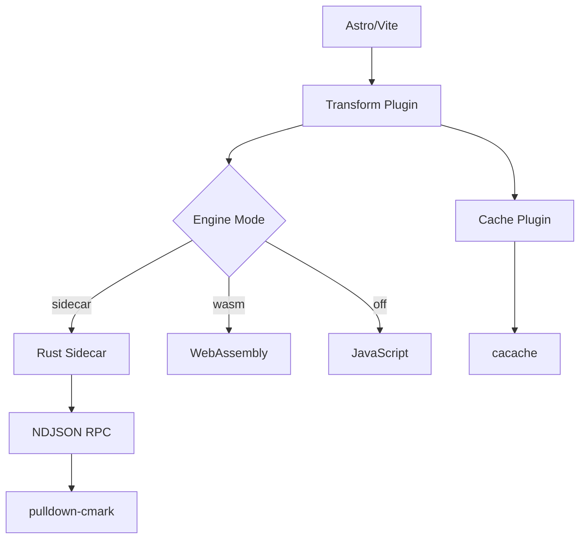

## Introduction

Fast MD-X is a **high-performance Markdown and MDX transformation system** built for modern web applications. It combines intelligent caching, optional Rust acceleration, and WebAssembly support to deliver blazing-fast content processing.

### Key Features

- ⚡ **3-10x faster** rebuilds with intelligent caching
- 🦀 **Rust sidecar** for 10-20% additional speedup
- 🌐 **WebAssembly** support for cross-platform acceleration
- 📦 **Monorepo architecture** with modular packages
- 🔄 **NDJSON RPC protocol** for efficient IPC
- 🎯 **Smart cache invalidation** based on content and dependencies

## Installation

Install Fast MD-X in your Astro project:

```bash
# Using pnpm (recommended)
pnpm add @fastmd/plugin-transform @fastmd/cache

# Using npm
npm install @fastmd/plugin-transform @fastmd/cache

# Using yarn
yarn add @fastmd/plugin-transform @fastmd/cache
```

### Prerequisites

- Node.js 18+ (20+ recommended)
- Astro 5.0+
- Vite 5.0+
- Optional: Rust toolchain for building the sidecar

## Quick Start

### Basic Setup

Configure Fast MD-X in your `astro.config.mjs`:

```javascript
import { defineConfig } from 'astro/config';
import fastmdCache from '@fastmd/cache';
import fastmdTransform from '@fastmd/plugin-transform';

export default defineConfig({
  vite: {
    plugins: [
      // Enable Rust sidecar transformation
      fastmdTransform({
        engine: 'sidecar', // or 'wasm' or 'off'
        logLevel: 'info'
      }),
      // Add caching layer
      ...fastmdCache({
        log: 'summary'
      })
    ]
  }
});
```

### Environment Variables

Control Fast MD-X behavior with environment variables:

| Variable | Values | Description |
|----------|--------|-------------|
| `FASTMD_RS` | `sidecar`, `wasm`, `off` | Select transformation engine |
| `FASTMD_LOG` | `silent`, `summary`, `verbose`, `json` | Logging verbosity |
| `FASTMD_CACHE_DIR` | Path | Custom cache directory |
| `FASTMD_SALT` | String | Cache key salt for invalidation |

### Build with Rust Sidecar

```bash
# Build with Rust acceleration
FASTMD_RS=sidecar pnpm build

# Verbose logging
FASTMD_LOG=verbose FASTMD_RS=sidecar pnpm build

# JSON logging for CI
FASTMD_LOG=json pnpm build
```

## Architecture Overview

Fast MD-X uses a modular architecture:



### Performance Characteristics

| Scenario | Cold Build | Warm Cache | With Sidecar |
|----------|------------|------------|--------------|
| Small site (10 pages) | 1.0x | 3-5x | 1.1-1.2x |
| Medium site (100 pages) | 1.0x | 5-8x | 1.15-1.25x |
| Large site (1000+ pages) | 1.0x | 8-10x | 1.2-1.3x |

## Next Steps

- [Configure your project](/docs/configuration)
- [Explore the API](/docs/api-reference)
- [Optimize performance](/docs/advanced/performance)
- [Learn about the Rust sidecar](/docs/advanced/rust-sidecar)

---

*Fast MD-X is optimized for developer experience and production performance.*